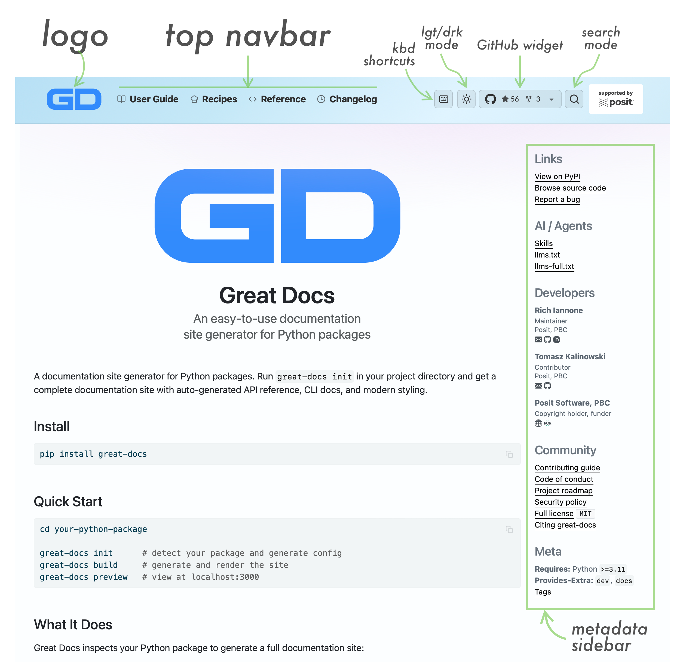
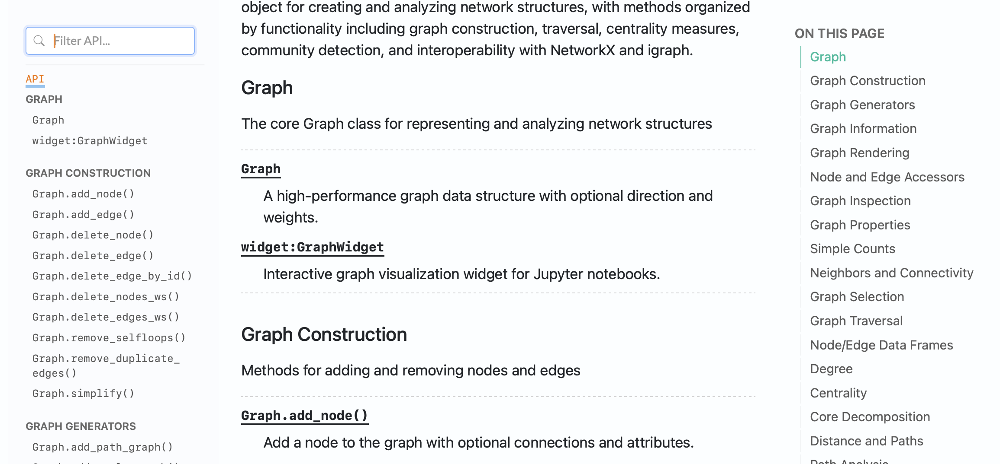
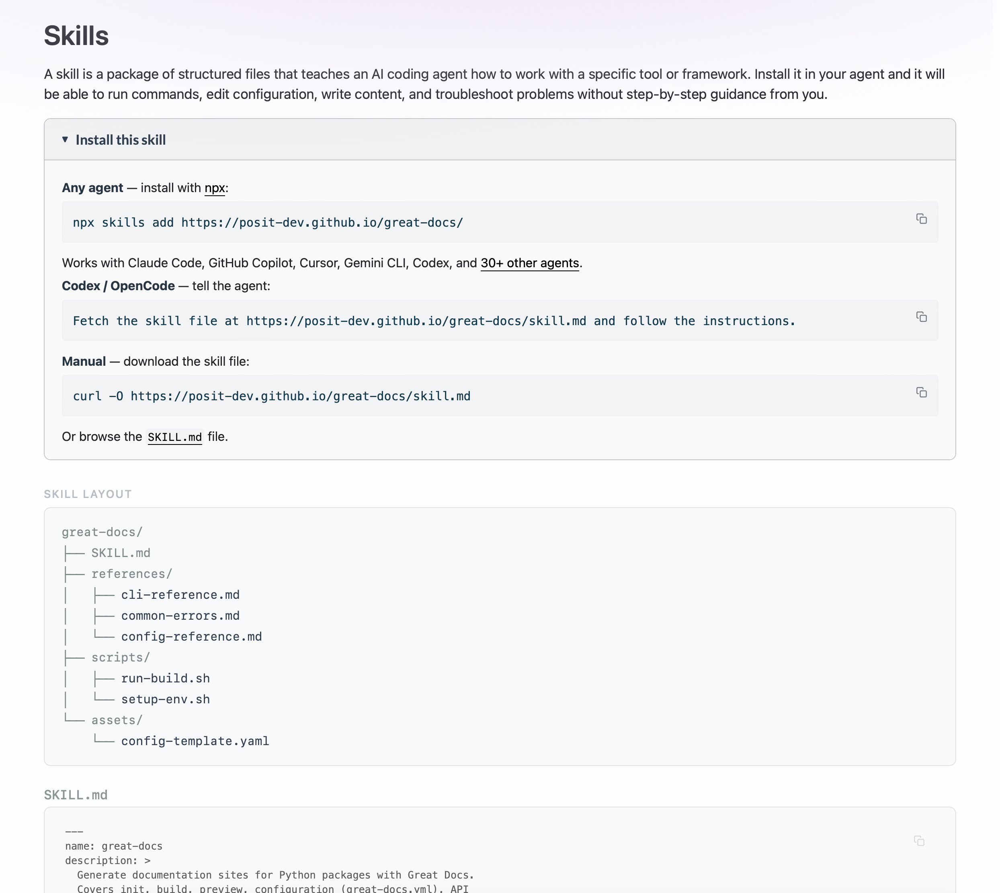
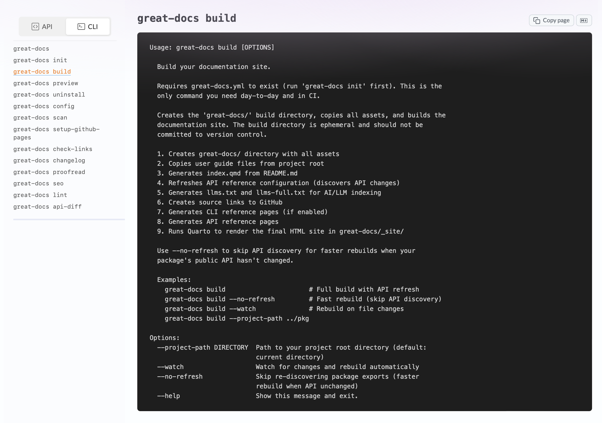

When someone discovers your Python package, the first thing they see is the documentation site. That site should look good, feel cohesive, and reflect the identity of your project. But most Python documentation generators leave you with a generic-looking site and little control over its personality without significant effort. Tweaking themes, adjusting layouts, and making the result feel like *your* project rather than a template usually means hours of configuration and CSS overrides.

With projects like [Great Tables](https://posit-dev.github.io/great-tables/) and [Pointblank](https://posit-dev.github.io/pointblank/), I wanted documentation sites that looked distinctive and match the character of each project. I was able to get pretty far with tools like quartodoc, but ultimately I had to do a lot of customization to get the styles I was looking for. That led me to build [Great Docs](https://posit-dev.github.io/great-docs/), a documentation generator that produces attractive sites out of the box (but with simple options to customize the look and make it yours). Great Docs is now part of the [Posit](https://posit.co/) open-source ecosystem, [available on PyPI](https://pypi.org/project/great-docs/), and at `v0.7` with seven releases since its initial soft launch.



## What Is Great Docs?

Great Docs is a documentation site generator for Python packages. You point it at your project and it produces a documentation site with API reference, CLI reference, user guides, changelog, and landing page. It auto-discovers your package's public API, generates [Quarto](https://quarto.org)-based pages, and renders the result into a static site.

The entire workflow involves just a few commands:

```bash
great-docs init       # one-time: auto-detect your package, write config
great-docs build      # build (or rebuild) the site
great-docs preview    # open it in your browser
```

There is no boilerplate to write, no templates to configure, and no theme to choose as the defaults produce a good-looking site on their own. If you want to go further, the `great-docs.yml` configuration file offers extensive customization: navbar gradients, content styles, announcement banners, author metadata, custom sections, and much more.

## Why Another Documentation Generator?

There is no shortage of documentation tooling in the Python ecosystem, but after years of building and maintaining documentation sites for my own packages, a few pain points kept surfacing:

**Discovery is manual.** Most tools require you to explicitly list every class, function, and method you want documented, which becomes tedious and error-prone as your package grows.

**The output looks dated.** Many popular generators produce sites that feel like they belong to an earlier era of the web. Mobile responsiveness, dark mode, and modern typography are afterthoughts, if they are supported at all.

**LLMs cannot easily consume the output.** Developers routinely paste documentation into AI assistants, and if your docs are not structured for machine consumption, the answers those assistants produce will be worse.

**Deployment is a separate project.** Getting from a built site to a live GitHub Pages deployment often involves manually writing CI workflows.

**No quality tools.** Most generators stop at rendering. If you want to check for broken links, catch spelling and grammar issues, or understand how your API has changed across versions, you are on your own with third-party tools and custom scripts.

Great Docs addresses all of these, and the rest of this post walks through the key features.

## Auto-Discovery: Your API, Documented Automatically

When you run `great-docs init`, the tool inspects your package and discovers its public API automatically. It finds classes, functions, dataclasses, protocols, enumerations, exceptions, type aliases, and more, using a combination of runtime introspection and static analysis via [griffe](https://mkdocstrings.github.io/griffe/). It detects your docstring style (NumPy, Google, or Sphinx) and writes a `great-docs.yml` configuration file that captures the full structure of your API.

The result is 13 distinct object-type categories: classes with many methods get their own dedicated sections, overloaded signatures are displayed correctly, and long signatures are formatted across multiple lines for readability (all without you having to enumerate a single export).

If you later add new functions or classes to your package, just run `great-docs init` again (or `great-docs build` with the `--scan` option) and the configuration updates to reflect your current API.



## Powered by Quarto and quartodoc

Great Docs is a fork of [quartodoc](https://machow.github.io/quartodoc/), which pioneered the idea of generating Quarto-based API reference pages for Python packages. All of the excellent work quartodoc does for API documentation (docstring rendering, cross-references between symbols, etc.) carries forward into Great Docs. On top of that foundation, Great Docs adds site-wide features like styling, interactive widgets, CLI reference, quality tools, and the LLM-friendly output described below.

Under the hood, Great Docs generates [Quarto](https://quarto.org) `.qmd` files and renders them into a static site. Quarto is a scientific and technical publishing system that supports executable code cells, rich cross-references, callout blocks, tabsets, and many other features useful for documentation, and by building on it Great Docs inherits all of these capabilities. User guides can include live code examples with rendered output, API reference pages get syntax highlighting via Pygments, and the entire site benefits from Quarto's rendering pipeline.

## Styling and Interactive Features

Great Docs ships with a set of styles and interactive features that cover most of what you would want from a documentation site:

- **Dark mode toggle** with system-preference detection and persistence across sessions
- **Animated navbar gradients** with eight preset themes (sky, peach, prism, lilac, mint, ocean, sunset, forest)
- **Subtle content gradients** that add visual warmth without distraction
- **GitHub widget** showing live star and fork counts
- **Sidebar search** for quickly filtering long API reference lists
- **Smart sidebar wrapping** that handles long class and method names gracefully
- **Responsive design** that works well on phones and tablets
- **Copy Page widget** for one-click copy-as-Markdown on reference pages
- **Back-to-top button** that appears after scrolling, with smooth animation and dark mode support
- **Keyboard navigation** with shortcuts for search (`/`), page browsing (`[`/`]`), dark mode (`d`), and a help overlay (`?`)
- **Social cards** with automatic Open Graph and Twitter Card meta tags for rich link previews
- **Page tags** for categorizing pages via YAML frontmatter, rendered as pill-shaped links above the title with an auto-generated tags index page
- **Page status badges** marking pages as *new*, *beta*, *deprecated*, or *experimental*, with color-coded badges below the title and compact icons in the sidebar
- **Inline icons** via the `` shortcode, giving access to 1,900+ [Lucide](https://lucide.dev/) icons that scale with text and inherit color
- **Navigation icons** via [Lucide](https://lucide.dev/) for navbar and sidebar labels
- **Internationalization** with support for 23 languages via a single `site.language` config option
- **JS Tooltips** replacing native browser tooltips with styled, theme-aware popovers
- **License feature badges** showing permissions, conditions, and limitations as color-coded badge groups

Dark mode and sidebar filtering are expected in any modern documentation site, keyboard shortcuts let you navigate without reaching for the mouse, and the navbar gradients give each project a distinct visual identity without requiring any design work from the package author.

## LLM-Friendly by Default

Great Docs automatically generates `llms.txt` and `llms-full.txt` files alongside your documentation site: structured, plain-text representations of your entire documentation designed for consumption by large language models.

Every reference page also gets a parallel Markdown version, and a "Copy Page" widget lets users (or AI assistants) grab the content of any page in Markdown format with a single click. A "View as Markdown" option renders the plain-text version directly in the browser.

Great Docs also supports the [Agent Skills](https://agentskills.io/) specification. If your project contains a `SKILL.md` file, Great Docs automatically discovers it, publishes the skill at `/.well-known/skills/`, and serves it for agent discovery without any configuration. If you do not have a hand-written skill, Great Docs generates one for you. Either way, coding agents like Claude Code, GitHub Copilot, Cursor, and Codex can find and install your package's skill with a single command:

```bash
npx skills add https://your-org.github.io/your-package/
```

You can also author a comprehensive, hand-written `SKILL.md` in your project and Great Docs will automatically discover and publish it. A detailed skill can include core concepts, step-by-step workflows, common error patterns with fixes, reference files for configuration and CLI commands, setup and build scripts, and a description of what the agent can and cannot do autonomously. Great Docs publishes the entire skill directory structure and renders it on a dedicated Skills page in your documentation site, with a visual layout of the skill's file tree, expandable sections for each companion file (references, scripts, assets), and install instructions for every major agent platform.



The practical effect is that when a developer asks an AI assistant "how do I use the `build()` method?", the quality of the answer depends on the quality of the documentation the model has access to. And when a coding agent needs to configure, build, or troubleshoot your package's docs, a structured skill file gives it enough context to act autonomously. These features mean the documentation works for human readers, LLM chat contexts, and agentic workflows.

## CLI Documentation

If your package has a [Click](https://click.palletsprojects.com/)-based command-line interface, Great Docs can generate reference pages for every command automatically. It discovers your CLI commands, renders each one with its arguments, options, and help text, and adds them to the site with a dedicated sidebar. A reference switcher dropdown lets users toggle between the API Reference and CLI Reference views.

All you have to do is specify the CLI module in your configuration:

```yaml
cli:
  enabled: true
  module: my_package.cli
  name: cli
```



Click is the starting point, but the [roadmap](https://posit-dev.github.io/great-docs/roadmap.html) includes support for Typer, argparse, and Fire, with a plugin interface for additional frameworks. The plan is also to move beyond raw `--help` output toward richer, API-reference-style rendering: styled parameter tables with type annotations and defaults, auto-generated usage examples, cross-references between subcommands and parent groups, environment variable documentation, and full search integration so CLI commands are indexed alongside API symbols.

## User Guides, Custom Sections, and Blogs

API reference alone is rarely sufficient. Developers need narrative documentation that explains concepts, walks through workflows, and provides context that docstrings cannot.

Great Docs supports a `user_guide/` directory where you place `.qmd` or `.md` files. You can also add hand-written HTML pages that are auto-discovered and integrated into the site with minimal transformation, which is useful for product landing pages, interactive demos, or any content that does not fit the `.qmd` workflow. These are automatically discovered and added to the site with their own navigation section. You can use numeric prefixes (e.g., `01-installation.qmd`, `02-quickstart.qmd`) to control ordering in the directory; Great Docs strips the prefixes from the generated URLs, so readers see clean paths like `/user_guide/installation.html`. Subdirectories are supported for hierarchical organization.

Beyond user guides, you can define arbitrary custom sections for recipes, tutorials, examples, or any other content grouping. And if you want a blog, Great Docs supports blog-type sections with chronological listings and Quarto's blog features built in.

```yaml
sections:
  - title: Recipes
    dir: recipes
    navbar_after: User Guide
```

## Source Code Links

Every documented class, method, and function gets an automatic link back to its source code on GitHub, with precise line-number ranges. This is powered by griffe's static analysis, so the links point to exactly the right lines, not just the file. The placement is configurable (in the usage section or next to the title), and you can specify the branch or tag to link against.

## One-Command Deployment

When your documentation is ready, deploying to GitHub Pages is a single command:

```bash
great-docs setup-github-pages
```

This generates a GitHub Actions workflow file that builds your documentation and deploys it automatically on every push. The workflow is configurable (branch, Python version, docs directory), and once it is in place, your documentation stays up to date with every commit.

## Quality Tools Built In

Great Docs includes tooling for keeping your documentation healthy:

- **`great-docs check`** audits your configuration against your actual exports, showing what is documented and what is missing
- **`great-docs check-links`** finds broken links across your documentation, with configurable timeouts and ignore patterns
- **`great-docs lint`** analyzes your public API for missing docstrings, broken cross-references, style mismatches, and unknown directives
- **`great-docs proofread`** runs local grammar and spelling checks powered by [Harper](https://writewithharper.com/), with a built-in technical dictionary and multiple output formats

All of these produce machine-readable JSON output, making them suitable for CI integration.

## Configuration

The `great-docs.yml` configuration file is the single source of truth for your documentation site. The defaults are sensible enough that most projects need very little customization, but when you do want to adjust things the options are extensive: display names, author metadata with ORCID identifiers, funding and copyright information, announcement banners, homepage modes, theme settings, sidebar behavior, and more.

Here is what a configuration might look like for a well-established project:

```yaml
display_name: My Package

announcement:
  content: "Version 2.0 is here! Check out the changelog."
  type: info
  style: lilac
  dismissable: true

navbar_style: sky
content_style: lilac

authors:
  - name: Mara Rosario
    role: Maintainer
    github: mbrosario
    orcid: 0000-0002-8471-3056

sections:
  - title: Tutorials
    dir: tutorials
    navbar_after: User Guide

cli:
  enabled: true
  module: my_package.cli
  name: cli

reference:
  sections:
    - title: Core
      contents: [MyApp, Config]
    - title: Utilities
      contents: [parse, validate, format_output]
```

## The Iterative Workflow

In practice, using Great Docs looks like this:

1. **`great-docs init`**: Run once to scaffold your configuration. Review the generated `great-docs.yml` and make any adjustments (reorder sections, add authors, enable CLI docs, etc.).

2. **Edit `great-docs.yml`**: Customize display name, add announcement banners, configure sections, set navbar gradients. This file is committed to your repository.

3. **`great-docs build`**: Rebuild whenever you want to see changes. This is fast and idempotent.

4. **`great-docs preview`**: Open the built site locally to review.

5. **Iterate**: Adjust configuration, write user guide pages, add recipes. Rebuild and preview.

6. **`great-docs setup-github-pages`**: When you are ready to go live, set up automated deployment. From this point on, every push to your main branch publishes updated documentation.

The `great-docs.yml` file and your `user_guide/` directory are the only things you commit. The entire `great-docs/` build directory is ephemeral and gitignored.

## What's Next

Great Docs is under active development and has shipped seven releases (`v0.1` through `v0.7`) since its initial launch. The [roadmap](https://posit-dev.github.io/great-docs/roadmap.html) is quite ambitious. Near-term priorities include author attribution with GitHub-style avatars, reading time estimates, breadcrumb navigation, and an enhanced CLI reference supporting Typer, argparse, and Fire alongside Click. Further out, the roadmap covers multi-version documentation with a version selector, multi-language API documentation spanning Python, R, Rust, and JavaScript, interactive examples powered by Pyodide or JupyterLite, notebook galleries, instant SPA-like page navigation, and a plugin system for third-party extensions.

## Get Started

Great Docs is open source under the MIT license and available on [PyPI](https://pypi.org/project/great-docs/). To get started:

```bash
pip install great-docs
cd your-python-project
great-docs init
great-docs build
great-docs preview
```

If you have feedback, feature ideas, or run into issues, please open an [issue on GitHub](https://github.com/posit-dev/great-docs/issues).
