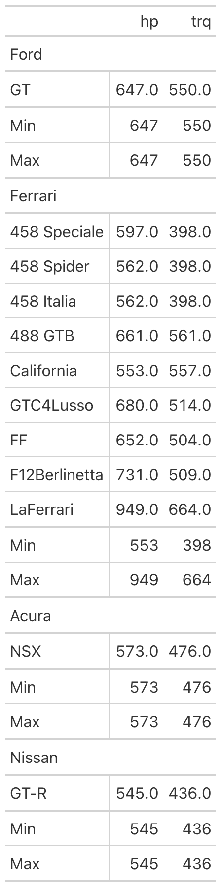
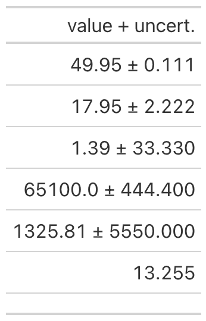
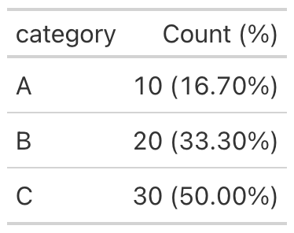
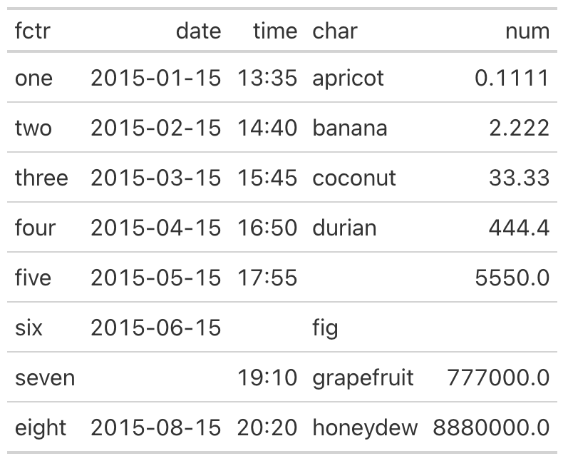
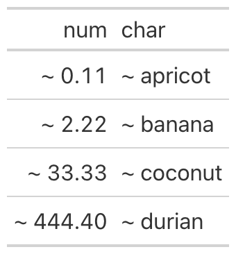
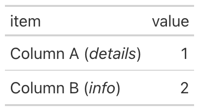
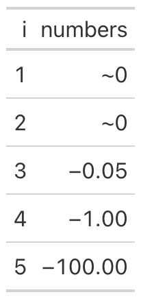
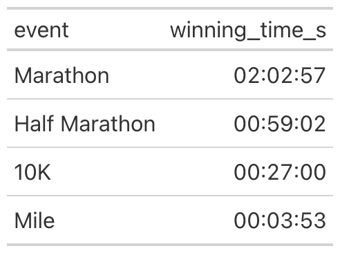
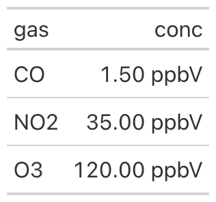
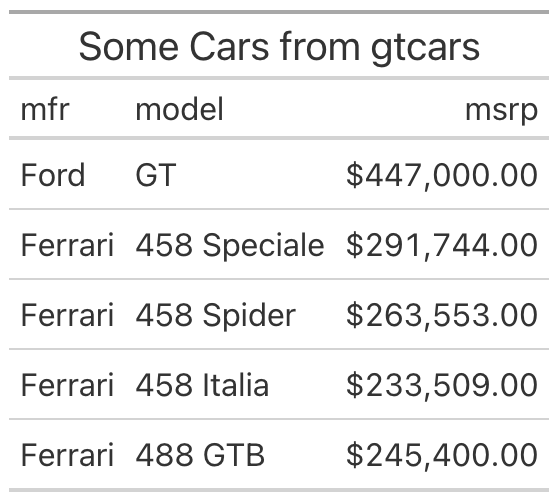

[Great Tables](https://posit-dev.github.io/great-tables/) gives you a grammar for assembling presentation-quality display tables in Python. You start from a DataFrame, declare which parts of the table mean what (the stub, the row groups, the column labels), and then layer on formatting, styling, and annotation until the table communicates exactly what you intend. The library has always taken much of its design from the [**gt** R package](https://gt.rstudio.com), and over successive releases the Python version has been steadily catching up to the capabilities that R users have enjoyed for years.

The `v0.22.0` release is the largest step in that direction so far. It introduces footnotes, group-wise summary rows, a family of column-merging methods, a suite of text transformations, several value-substitution helpers, two new formatting methods, and a modern image-export pipeline through `gtsave()`. The LaTeX output gained the ability to render stubs and row groups, and Pandas is no longer a required dependency. There is a great deal to cover, so this post walks through each addition in turn, with a small working example for every one.

## Footnotes with `tab_footnote()`

Footnotes are one of the oldest conventions in tabular presentation, and they solve a real problem: sometimes a value, a label, or a heading needs a short explanation that would clutter the table if placed inline. The new `tab_footnote()` method attaches a footnote to any location in the table and manages the marks for you, numbering them sequentially in the order they appear and collecting the notes themselves in the table's footer.

A location is specified with one of the `loc.*` helpers, the same ones used elsewhere in the library for styling. You can attach a note to cells in the stub, to a column label, to the subtitle, or to body cells. Because the footnote text accepts `md()` and `html()`, you can format it with Markdown or raw HTML just as you would any other piece of table content.

```python
import polars as pl
from great_tables import GT, loc, md
from great_tables.data import towny

towny_mini = (
    pl.from_pandas(towny)
    .filter(pl.col("csd_type") == "city")
    .select(["name", "density_2021", "population_2021"])
    .top_k(10, by="population_2021")
    .sort("population_2021", descending=True)
)

(
    GT(towny_mini, rowname_col="name")
    .tab_header(
        title=md("The 10 Largest Municipalities in `towny`"),
        subtitle="Population values taken from the 2021 census.",
    )
    .fmt_integer()
    .cols_label(density_2021="Density", population_2021="Population")
    .tab_footnote(
        footnote="Part of the Greater Toronto Area.",
        locations=loc.stub(rows=[
            "Toronto", "Mississauga", "Brampton", "Markham", "Vaughan"
        ]),
    )
    .tab_footnote(
        footnote=md("Density is in terms of persons per {{km^2}}."),
        locations=loc.column_labels(columns="density_2021"),
    )
    .tab_footnote(
        footnote="Census results made public on February 9, 2022.",
        locations=loc.subtitle(),
    )
    .opt_footnote_marks(marks="letters")
)
```


The marks themselves are configurable through `opt_footnote_marks()`. The default is a standard set of typographic symbols, but you can switch to numbers or letters, as we did above with `marks="letters"`. The `placement=` argument on `tab_footnote()` controls whether a mark sits to the left or right of the cell content, and the default `"auto"` chooses a side based on the cell's alignment.

## Group-wise summaries with `summary_rows()`

When a table is divided into row groups, readers frequently want a per-group summary: a total, a mean, a minimum and maximum. The `summary_rows()` method computes these and inserts them as labeled rows within each group, either at the bottom (the default) or at the top.

The aggregations are described with the `fns=` argument, a dictionary whose keys become the row labels and whose values are the expressions to evaluate. The expressions can be Polars expressions, which is the most concise option when your data is a Polars DataFrame, or plain Python callables that receive a DataFrame subset. A formatting function from the `vals.*` family can be passed through `fmt=` so that the summary values match the formatting of the rest of the table.

```python
import polars as pl
from great_tables import GT, vals
from great_tables.data import gtcars

gtcars_mini = (
    pl.from_pandas(gtcars)
    .select(["mfr", "model", "hp", "trq"])
    .head(12)
)

(
    GT(gtcars_mini, rowname_col="model", groupname_col="mfr")
    .summary_rows(
        fns={
            "Min": pl.col("hp", "trq").min(),
            "Max": pl.col("hp", "trq").max(),
        },
        fmt=vals.fmt_integer,
    )
)
```



By default the summary applies to every group, but the `groups=` argument narrows it to a named subset when you only need summaries in certain places. The release also includes `grand_summary_rows()`, a companion method that produces a single summary across the entire table rather than one per group. Both kinds of summary can be targeted for styling through `loc.summary()` and `loc.grand_summary()`, so you can shade them or set them apart from the regular body rows.

## Merging columns together

Tables often hold several columns that, conceptually, describe a single quantity. A value and its uncertainty, the lower and upper ends of a range, or a count paired with its percentage all read better as one column than as two. The release adds a family of merge methods for exactly these situations, along with a generic method for everything else.

The most specialized of these is `cols_merge_uncert()`, which combines a measured value with its uncertainty and renders the pair with a plus-or-minus separator. You provide the value column and the uncertainty column, and the second column is hidden automatically once it has been folded into the first.

```python
from great_tables import GT
from great_tables.data import exibble
import polars as pl

exibble_mini = (
    pl.from_pandas(exibble)
    .select("num", "currency")
    .slice(0, 7)
)

(
    GT(exibble_mini)
    .fmt_number(columns="num", decimals=3, use_seps=False)
    .cols_merge_uncert(col_val="currency", col_uncert="num")
    .cols_label(currency="value + uncert.")
)
```



The `cols_merge_range()` method works the same way for a pair of columns that mark the beginning and end of a range, joining them with an en dash by default (the separator is adjustable through `sep=`). The `cols_merge_n_pct()` method pairs a count with a percentage, rendering values in the familiar `10 (16.70%)` form and suppressing the percentage when the count is zero.

```python
from great_tables import GT
import polars as pl

df = pl.DataFrame({
    "category": ["A", "B", "C"],
    "n": [10, 20, 30],
    "pct": [0.167, 0.333, 0.500],
})

(
    GT(df)
    .fmt_percent(columns="pct")
    .cols_merge_n_pct(col_n="n", col_pct="pct")
    .cols_label(n="Count (%)")
)
```



For anything that does not fit those three patterns there is the generic `cols_merge()`, which takes a list of columns and a `pattern=` template. The template uses zero-based indices in braces to refer to the columns, so a pattern of `"{0} to {1}"` interleaves the first and second columns with the literal text between them. The first column named becomes the visible, merged column, and the rest are hidden by default. This is the general mechanism on which the specialized methods are built, and it is the right tool when your desired arrangement is unusual.

A related convenience is `cols_reorder()`, which rearranges every column in a single call. Previously, a full reordering meant a sequence of `cols_move_*()` invocations; now you can list the columns in the order you want and have the table laid out accordingly. The method expects every column to appear exactly once, raising an error if any are omitted or duplicated, which guards against the silent loss of a column.

```python
from great_tables import GT
from great_tables.data import exibble

exibble_mini = exibble[["num", "char", "fctr", "date", "time"]]

(
    GT(exibble_mini)
    .cols_reorder(["fctr", "date", "time", "char", "num"])
)
```



## A suite of text transformations

Formatting methods handle numbers, dates, and currencies, but cell content sometimes needs a transformation that no formatter anticipates. The release introduces four `text_*()` methods that operate on the rendered text of cells, each addressing a different shape of problem.

The most general is `text_transform()`, which applies an arbitrary function to the text of the targeted cells. The function receives the cell's current string and returns a new one, which makes it suitable for any transformation you can express in Python. Because it runs after formatting, you can format a value first and then decorate the result.

```python
from great_tables import GT, loc, exibble

(
    GT(exibble[["num", "char"]].head(4))
    .fmt_number(columns="num", decimals=2)
    .text_transform(
        locations=[loc.body(columns="num"), loc.body(columns="char")],
        fn=lambda x: f"~ {x}",
    )
)
```



When the transformation is a regular-expression substitution, `text_replace()` is more direct. It takes a `pattern=` and a `replacement=`, and it supports capture groups, so you can wrap or rearrange matched text. The example below finds parenthetical text and emphasizes it with HTML tags.

```python
import pandas as pd
from great_tables import GT, loc

df = pd.DataFrame({
    "item": ["Column A (details)", "Column B (info)"],
    "value": [1, 2],
})

(
    GT(df)
    .text_replace(
        pattern=r"\((.+?)\)",
        replacement=r"(<em>\1</em>)",
        locations=loc.body(columns="item"),
    )
)
```



The remaining two methods cover conditional replacement. `text_case_match()` is a switch-like construct: each case is a tuple pairing one or more values to match against a replacement string, with an optional `default=` for everything unmatched. `text_case_when()` generalizes this to predicates, where each case pairs a function that returns a boolean with the replacement to use when it is true. The case ordering matters, since the first matching predicate wins, which makes it a natural fit for binning a numeric column into labels.

```python
import pandas as pd
from great_tables import GT, loc

df = pd.DataFrame({"score": [95, 72, 88, 61, 100]})

(
    GT(df)
    .fmt_number(columns="score", decimals=0)
    .text_case_when(
        (lambda x: int(x) >= 90, "A"),
        (lambda x: int(x) >= 80, "B"),
        (lambda x: int(x) >= 70, "C"),
        default="F",
        locations=loc.body(columns="score"),
    )
)
```


## Substituting specific values

Closely related to text transformation is the act of replacing particular values for the sake of readability. A column of measurements might contain values too small to be meaningful, or zeros that would be better shown as a dash, or missing entries that should read as something other than a blank. The release adds a family of `sub_*()` methods for these cases: `sub_missing()` for missing values, `sub_zero()` for zeros, `sub_small_vals()` and `sub_large_vals()` for values beyond a threshold, and the general `sub_values()` for replacing any specified value.

The small-value substitution is representative. It replaces values whose magnitude falls below a `threshold=` with a chosen pattern, which is useful when very small numbers carry no real information and only distract. The `sign=` argument restricts the substitution to positive or negative values, so you can treat the two tails of a distribution differently.

```python
from great_tables import GT
import polars as pl

neg_vals_df = pl.DataFrame({
    "i": range(1, 6),
    "numbers": [-0.0001, -0.005, -0.05, -1.0, -100.0],
})

(
    GT(neg_vals_df)
    .fmt_number(columns="numbers")
    .sub_small_vals(sign="-", threshold=0.01, small_pattern="~0")
)
```



These methods operate on the underlying values rather than on rendered text, so they compose cleanly with the formatting methods. You decide what counts as missing, zero, small, or large, and the table presents those cases consistently wherever they occur.

## Two new formatters: durations and parts-per

The formatting family gained two members. The first, `fmt_duration()`, renders durations in any of several styles. Numeric inputs are interpreted according to an `input_units=` setting (seconds, minutes, hours, days, or weeks), while Polars `Duration` columns are detected automatically. The `duration_style=` argument selects between a narrow style such as `5d 3h`, a wide style such as `5 days, 3 hours`, a colon-separated style such as `02:15:30`, and ISO 8601. The example below renders race times as zero-padded `HH:MM:SS`.

```python
import pandas as pd
from great_tables import GT

df = pd.DataFrame({
    "event": ["Marathon", "Half Marathon", "10K", "Mile"],
    "winning_time_s": [7377, 3542, 1620, 233],
})

(
    GT(df)
    .fmt_duration(
        columns="winning_time_s",
        input_units="seconds",
        duration_style="colon-sep",
        output_units=["hours", "minutes", "seconds"],
    )
)
```



The second formatter, `fmt_partsper()`, handles parts-per quantities: per-mille, parts per million, parts per billion, and finer scales still. The `to_units=` argument names the target quantity, the values are scaled to match unless you opt out with `scale_values=False`, and the symbol is rendered appropriately for both HTML and LaTeX output. The example formats gas concentrations as parts per billion by volume.

```python
import polars as pl
from great_tables import GT

concentrations = pl.DataFrame({
    "gas": ["CO", "NO2", "O3"],
    "conc": [1.5, 35.0, 120.0],
})

(
    GT(concentrations)
    .fmt_partsper(
        columns="conc",
        to_units="ppb",
        scale_values=False,
        symbol="ppbV",
    )
)
```



## Saving tables as images with `gtsave()`

A display table is often destined for a slide deck, a report, or a README, and in those settings you need an image rather than live HTML. The new `gtsave()` method produces one by rendering the table in a headless instance of Chrome and capturing it. It writes PNG, JPEG, WebP, and PDF, choosing the format from the file extension you supply.

```python
from great_tables import GT
from great_tables.data import gtcars
import polars as pl

gtcars_mini = (
    pl.from_pandas(gtcars)
    .select(["mfr", "model", "msrp"])
    .head(5)
)

(
    GT(gtcars_mini)
    .tab_header(title="Some Cars from gtcars")
    .fmt_currency(columns="msrp")
    .gtsave("my_table.png")
)
```



Several arguments control the capture. The `zoom=` factor governs the resolution of raster output, with higher values producing sharper images, while `expand=` adds padding around the table and `vwidth=`/`vheight=` set the viewport. The `gtsave()` method replaces the older `save()`, which is now deprecated; existing code will continue to work for the time being, but new work should use `gtsave()`.

## Better LaTeX output

Great Tables can render to LaTeX as well as HTML, and that path received substantial attention in this release. LaTeX output now supports the stub and row groups, including spanning column headers and the row-group-as-column layout, which means that tables relying on these structural features are no longer limited to HTML. In addition, Markdown and HTML content placed in cells, headers, or footnotes is now converted to its LaTeX equivalent during rendering, so styled text survives the trip into a LaTeX document rather than appearing as literal markup. For anyone producing tables destined for a paper or a typeset report, the LaTeX output is now much closer in capability to the HTML output.

## Polars without Pandas

Until now, Great Tables required Pandas even if all of your work was in Polars. As of this release, Pandas is an optional dependency, and the library is fully functional with Polars alone. For Polars-first projects and for lightweight environments where every dependency counts, this removes a sizable transitive install that was not actually needed. Pandas users are unaffected: a DataFrame from either library works as input exactly as before, and the choice of backend remains yours.

## Getting started

Great Tables `v0.22.0` is available now on PyPI, so a `pip install great-tables` (or an upgrade of an existing install) brings everything described here. The [documentation site](https://posit-dev.github.io/great-tables/), which moved to [Great Docs](https://posit-dev.github.io/great-docs/) as its generator in this release, covers each method in detail with runnable examples, and the [User Guide](https://posit-dev.github.io/great-tables/get-started/) has been updated to reflect the new features. The [GitHub repository](https://github.com/posit-dev/great-tables) holds the source, the full changelog, and the issue tracker. This release also welcomed several first-time contributors, and if you would like to join them, or simply have a feature to request or a bug to report, the issue tracker is the place to start.
